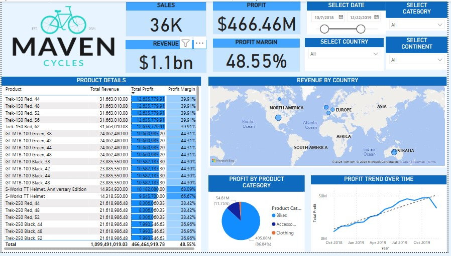

# Maven_Cycles_Sales_Performance_dashboard
Power BI dashboard for Maven Cycles sales performance in 2019–2020

## Overview
This Power BI dashboard analyses sales performance for Maven Cycles during 2019 and 2020, including revenue, profit, and category-level trends.

## Features
- KPI Cards for Total Sales, Revenue, Profit, and Profit Margin
- Profit Trend Over Time (Line Chart)
- Profit by Product Category (Pie Chart)
- Revenue by Country (Map)
- Product-level Detail Table with Conditional Formatting
- Date, Country, Continent and Category Slicers

## Dataset
Sales and product data derived from Maven Cycles, with supporting lookup tables for product hierarchy, customer age groups, and regions.

## How to Use
1. Open the `.pbix` file in Power BI Desktop.
2. Use slicers to explore insights interactively.
3. Modify visuals or add new ones as needed.

## Screenshots

## Author
Uchechukwu Ekemezie
